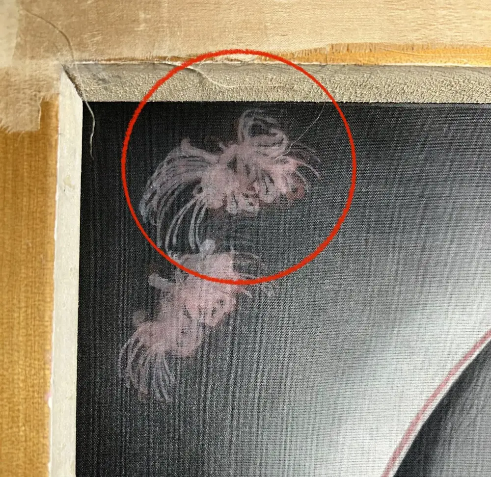
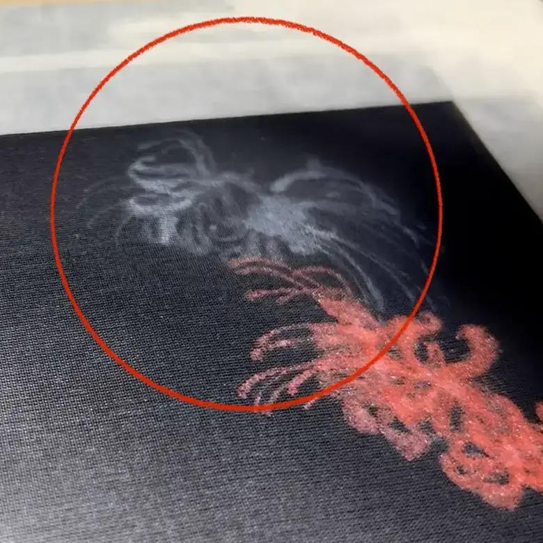
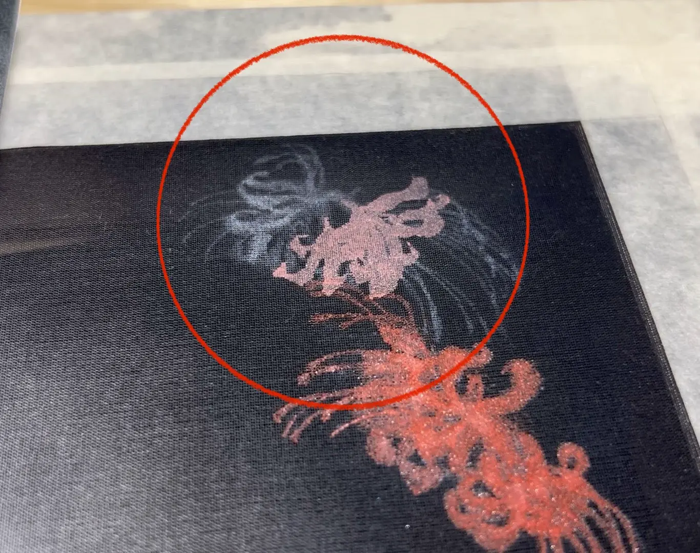

我手上有一件絹本，細緻的黑色背景已經畫好，接下來要在上面畫一叢紅花——然後就卡住了。全部描邊太費工；直接上色，怕花的邊界被背景吃掉；想學水彩用留白膠先擋再撕，又怕紅色從半透明的絹底下透出來，整個方法失去意義。

如果你也畫工筆或膠彩、在深色背景的絹本上卡過同一關，這篇是我把這個問題拿去查核後整理出來的三條路：**用線定邊界再分層上色（分染罩染）、從絹的背面墊色（裏彩色／背染）、用膠礬紙做實體遮蓋（面蓋）**。每條附步驟、心法和風險，文末有比較表與測試建議。

## 為什麼深色背景上畫主體這麼難——絹是半透明的

問題的根源只有一個：**絹是半透明基底**。

生絹要先用膠礬水處理過才不會滲色，但處理完它仍然透光——先上的顏色，會從後蓋的色層底下隱約透出來。這帶來幾個連鎖效應：

- **薄塗會被吃掉**：在黑底上直接薄塗紅色，紅色蓋不住黑，邊界和彩度一起糊掉。
- **厚塗會失去通透**：硬要用厚顏料壓過黑底，畫是蓋住了，但絹最珍貴的清透感也沒了——那不如畫在紙上。
- **複雜形狀會走位**：黑色一畫上去，底稿的線被蓋住，若無透光版協助，正面難以看清楚。花形簡單還能憑記憶抓，複雜的只能猜，猜錯重畫很花時間。

所以「深色背景上畫主體」的解法，本質上都在回答兩個問題：**邊界要靠什麼守住？**（靠線、靠背面墊色、還是靠實體遮蓋）以及**形狀複雜時，怎麼在正面重新看到底稿在哪**——這就是接下來的三個方案。

## 方案一：鉤勒定邊＋分染罩染——邊界靠線守住

最穩健的一條路，也是工筆畫最正統的設色邏輯。你不需要描完整朵花的所有脈絡——只要用線把「花」和「背景」分開就夠了。

| 步驟 | 做法 | 關鍵心法 |
| :--- | :--- | :--- |
| 1 | 用墨線白描勾勒花朵的**外輪廓**（對應工筆「鉤勒／雙鉤」的造型根基） | 這條線的功能是擋住黑色背景，不是畫細節——只要明確分出花與背景即可 |
| 2 | 在線圈好的範圍內，用硃砂、曙紅等不透明礦物顏料**分染**出深淺 | 深色絹地上可以適度提高顏料濃度，但仍是分層薄疊 |
| 3 | 乾後**罩染**統整色調，反覆疊加 | 工筆的核心是「三礬九染」式的薄疊——分層疊出來的紅比一次厚塗更飽滿、更不容易髒 |
| 4 | 全乾後用胡粉或淺紅色的線勾出花瓣脈絡 | 細節畫在最上層，完全不用管複雜的黑底 |

傳統慣例：墨線深淺依花色——重色花（大紅、紫）勾重墨線，白、黃、淺粉勾淺墨線。黑底紅花屬前者，外輪廓放心畫重。

<figure>
<svg viewBox="0 0 600 320" role="img" aria-label="示意圖：由下到上依序疊層，對齊上表四步驟——墨線白描外輪廓、分染出深淺、罩染統整反覆疊加、胡粉勾脈絡細節" xmlns="http://www.w3.org/2000/svg" style="width:100%;height:auto;">
  <title>方案一示意圖：鉤勒定邊＋分染罩染（對齊步驟表）</title>
  <rect x="0" y="0" width="600" height="320" fill="#141414" rx="12"/>
  <defs>
    <linearGradient id="fenranGrad" x1="0%" y1="0%" x2="100%" y2="0%">
      <stop offset="0%" stop-color="#f0c4bb"/>
      <stop offset="100%" stop-color="#c14a37"/>
    </linearGradient>
  </defs>
  <rect x="60" y="210" width="260" height="54" rx="6" fill="#2a2a2a" stroke="#e8ddc7" stroke-width="2"/>
  <text x="190" y="242" text-anchor="middle" font-family="sans-serif" font-size="14" fill="#f2ede0">1｜白描：墨線外輪廓</text>
  <rect x="100" y="152" width="260" height="54" rx="6" fill="url(#fenranGrad)"/>
  <text x="230" y="184" text-anchor="middle" font-family="sans-serif" font-size="14" fill="#2a1410">2｜分染：染出深淺</text>
  <rect x="140" y="94" width="260" height="54" rx="6" fill="#9c281c"/>
  <text x="270" y="126" text-anchor="middle" font-family="sans-serif" font-size="14" fill="#f2ede0">3｜罩染：統整反覆疊加</text>
  <rect x="180" y="36" width="260" height="54" rx="6" fill="#f6ece5"/>
  <path d="M220,58 Q260,50 300,60" stroke="#c9a99a" stroke-width="2" fill="none"/>
  <path d="M220,70 Q260,62 300,72" stroke="#c9a99a" stroke-width="2" fill="none"/>
  <text x="310" y="68" text-anchor="middle" font-family="sans-serif" font-size="14" fill="#3a2e22">4｜胡粉：勾脈絡細節</text>
</svg>
<figcaption>示意圖：由下到上＝表格步驟 1→4——白描外輪廓、分染出深淺、罩染統整反覆疊加、胡粉勾脈絡細節</figcaption>
</figure>

## 方案二：裏彩色／背染——從絹的背面墊亮主體

這是絹本獨有、也是這題最漂亮的解法。日本畫稱**裏彩色（うらざいしき）**或「裏具」，中國工筆對應的術語是**背染**：從絹的背面上色，讓顏色透過半透明的絹從正面透出來，替主體墊一層底。

這跟前面的「正面厚塗」不同：背面顏色隔著絹稀釋、擴散後才透出來，不會像正面厚塗那樣把畫面蓋死；但通透感還是會被犧牲一部分，稀釋只是讓代價變小，不是消失。

可行的物理前提：絹本傳統是把絹繃在木框（絹枠）上作畫，**背面全程外露、隨時可以翻過去上色**——和裱死在板上的紙本完全不同。

依[日本畫教學的裏彩色解說](https://nihongastyle.com/urazaisiki)整理，標準順序是五步：

| 步驟 | 做法 | 關鍵心法 |
| :--- | :--- | :--- |
| 1 | 繃絹上框 | 背面保持可觸及，是整套技法的前提 |
| 2 | 轉寫底稿 | — |
| 3 | **正面骨描**（墨線勾輪廓） | **邊界靠線定，不靠顏色蓋**——這是最容易做錯的一步 |
| 4 | **背面施裏具**：在花形區域塗襯底色 | 背面可以塗得紮實，它的工作是墊亮，不是定形；顏色依目的選——要飽和度就塗紅，要讓底稿透出來當參考線就塗白 |
| 5 | 正面畫黑背景，最後對花**輕度補色**（塗り返し） | 因為背面有襯底，正面薄薄提色就飽滿；但通透感不是完整保留，背面那層顏料還是會稀釋掉一部分 |

注意順序：不是「先整片上紅、再看黑底透不透」，而是**線先定形、背面墊亮、正面收尾**。我原本的直覺（先上色再遮再撕）恰好把順序做反了——這也是查核時被修正最多的一段。

這條路對複雜花形特別關鍵：背面墊白能讓底稿的形狀直接透到正面，正面就有參考線可以依循，不用憑感覺猜邊界、猜錯重畫。我這件黑底紅花的花形線條密集，就是為了這點選了這條路，過程照片如下：

<figure style="flex:1 1 220px;max-width:280px;margin:0;">

<figcaption style="font-size:0.85em;">背面先上白色胡粉墊底(參考圖須左右反轉或使用透光原理輔助)。</figcaption>
</figure>

<figure style="flex:1 1 220px;max-width:280px;margin:0;">

<figcaption style="font-size:0.85em;">上完後正面的樣子，微微透出白色。</figcaption>
</figure>

<figure style="flex:1 1 220px;max-width:280px;margin:0;">

<figcaption style="font-size:0.85em;">就能在此之上進行顏料疊加。</figcaption>
</figure>

> **風險提醒**：裱畫師的討論指出，這類背面顏料層在日後**重新裱裝**、揭除舊裡打紙時會直接碰水，有較高的剝落風險。如果這件作品未來可能重裱，動筆前要先想清楚這個取捨。
>

## 方案三：面蓋——想遮蓋可以，但別用水彩留白膠

「先保護花形空白 → 畫黑背景 → 撕除 → 最後畫花」這個順序本身完全成立，問題出在材料。

水彩圈的[留白膠使用經驗](https://ciaoyinluo.com/how-to-use-watercolor-masking-fluid/)相當一致：要厚磅的優質水彩紙才經得起撕除，紙質鬆散就容易撕破；留白膠停留太久（大約超過兩天）會變得難撕、甚至永久黏死；撕除後邊緣生硬還要再修。**絹的纖維比水彩紙更鬆、更脆弱，這些風險只會加倍**——所以「留白膠不適合絹」的直覺是對的，而且主因不只是透色，是材質耐受度。

絹本傳統裡真正對應的技法叫**面蓋**——用紙做實體遮蓋，不用橡膠質的留白膠：

| 步驟 | 做法 | 關鍵心法 |
| :--- | :--- | :--- |
| 1 | 用膠礬水處理過的薄美濃紙，剪出花的形狀 | 薄紙經膠礬處理後有防水性，也貼得服 |
| 2 | 以膠礬水或澱粉糊把紙貼附在絹面的花形區域 | 黏著劑是水性的膠礬／澱粉糊，對絹纖維友善 |
| 3 | 直接在紙貼上方畫黑色背景 | 刷毛可以放心均勻塗，不怕侵入花的範圍 (⚠️這點有疑慮，若是暈染水分掌握不當，恐會滲透進花的範圍) |
| 4 | 背景全乾後撕除紙貼 | 沒有膠液滲入絹目的問題，撕除拉力遠小於留白膠 |
| 5 | 在露出的乾淨絹面上畫紅花 | 花畫在最上層，色彩完全不受背景干擾 |

此方法只在整理時與 AI 討論，並無實作支撐。

順帶一提：西式絹染（法式 serti）的「gutta 防染膠」屬染料工藝，和東亞絹本繪畫是兩個傳統，別直接借用。

<figure>
<svg viewBox="0 0 600 260" role="img" aria-label="示意圖：紙貼遮蓋花形→自由畫黑背景→撕除露出乾淨絹面，三步驟流程" xmlns="http://www.w3.org/2000/svg" style="width:100%;height:auto;">
  <title>方案三示意圖：面蓋</title>
  <rect x="0" y="0" width="600" height="260" fill="#141414" rx="12"/>
  <rect x="20" y="30" width="160" height="160" fill="#e6dbc3" rx="8"/>
  <circle cx="100" cy="110" r="45" fill="#cbb98e" stroke="#8a7a55" stroke-width="2" stroke-dasharray="4 3"/>
  <rect x="220" y="30" width="160" height="160" fill="#161616" rx="8"/>
  <circle cx="300" cy="110" r="45" fill="#cbb98e" stroke="#8a7a55" stroke-width="2" stroke-dasharray="4 3"/>
  <rect x="420" y="30" width="160" height="160" fill="#161616" rx="8"/>
  <circle cx="500" cy="110" r="45" fill="#e6dbc3"/>
  <defs>
    <marker id="arrow3" markerWidth="8" markerHeight="8" refX="6" refY="3" orient="auto">
      <path d="M0,0 L6,3 L0,6 Z" fill="#c99a4a"/>
    </marker>
  </defs>
  <line x1="182" y1="110" x2="218" y2="110" stroke="#c99a4a" stroke-width="2" marker-end="url(#arrow3)"/>
  <line x1="382" y1="110" x2="418" y2="110" stroke="#c99a4a" stroke-width="2" marker-end="url(#arrow3)"/>
  <text x="100" y="215" text-anchor="middle" font-family="sans-serif" font-size="14" fill="#f2ede0">1. 貼紙型</text>
  <text x="300" y="215" text-anchor="middle" font-family="sans-serif" font-size="14" fill="#f2ede0">2. 畫黑背景</text>
  <text x="500" y="215" text-anchor="middle" font-family="sans-serif" font-size="14" fill="#f2ede0">3. 撕除，露出乾淨絹</text>
</svg>
<figcaption>示意圖：紙貼遮蓋花形→自由畫黑背景→撕除露出乾淨絹面，三步驟流程</figcaption>
</figure>

## 三種深色背景畫法的比較與風險

| 方案 | 技法名稱 | 難度 | 通透感 | 主要風險 | 適合情境 |
| :--- | :--- | :--- | :--- | :--- | :--- |
| 一 | 鉤勒＋分染罩染 | 中 | 高 | 最低——只有疊色耐心問題 | 首選；想穩穩完成這件作品 |
| 二 | 裏彩色／背染 | 中高 | 中高（背面墊色仍會犧牲部分通透感，並非零代價——實作後認為普通，非最高） | 重裱時背面顏料可能剝落；厚絹效果打折 | 絹夠薄、想要最乾淨的發色 |
| 三 | 面蓋 | 中 | 高 | 紙貼邊緣精準度考驗剪工；撕除仍需輕手 | 背景筆刷動作大、怕手滑掃到主體 |

三案不互斥——理論上完全可以「面蓋保護畫背景，撕除後用鉤勒＋分染畫花，關鍵幾瓣再用背染墊亮」。另外有兩個守邊界的輔助小技法可以搭配：**水線**（沿物體邊緣留一道亮邊）與**烘染**（主體周圍用淡彩染一圈襯托交界）——這兩項只查到單一來源，建議再自行核實。

## 動手前：想保險，先用廢絹測一輪

背面本來就外露、能先在角落小範圍試色，風險有限，且自行斟酌。但**絹的個體差異很大**（厚薄、礬度、織目），絹貴或第一次試這些技法，能先用同批廢絹做三個小測試：

1. **蓋色力測試**：塗一小塊黑底，乾後分別薄疊與濃塗紅色，看幾層能到你要的彩度
2. **透色測試**：廢絹背面塗紅，正面看透出的強度——這直接告訴你方案二在你這批絹上值不值得
3. **撕除測試**：貼一小片膠礬紙、畫過、乾透再撕，看絹面有無起毛

## 重點整理

| 問題 | 答案 |
| :--- | :--- |
| 黑底上紅花為什麼會糊？ | 絹半透明，薄塗蓋不住、厚塗失通透 |
| 花形複雜、正面看不到底稿怎麼辦？ | 背面墊白讓底稿透到正面當參考線——方案二對複雜形狀特別關鍵，省下猜邊界、猜錯重畫的時間 |
| 邊界靠什麼守？ | 線（方案一）、背面墊色（方案二）、實體遮蓋（方案三） |
| 留白膠能用嗎？ | 不建議——絹纖維經不起撕除，改用膠礬紙面蓋 |
| 動手前怎麼保險？ | 廢絹三測試：蓋色力、透色、撕除 |

**一句話：深色背景上的主體，邊界永遠靠線和遮蓋守住，不要靠顏色互蓋去賭。**

我自己那叢紅花選了方案二，過程照片就在上面裏彩色那段；這件完成後的整理記錄也會發在這個站的繪畫線。把這篇收藏起來，動筆前照「廢絹測試」那段跑一次小樣；如果你在絹上處理深色背景有不同的做法，歡迎透過站上的聯絡方式告訴我，我會把有價值的做法補進這篇。

## 參考來源

- [日本画の技法『裏具/裏彩色』は絹本制作必須スキル！](https://nihongastyle.com/urazaisiki) — DARENIHO 誰でも日本画教室
- [日本画 絹本の描き方](https://www.art-sacco.com/entry/kenpon_kingyo) — お絵描きeveryday（絹本金魚實作記錄）
- [工笔花鸟的各种染法](https://mysx123.com/archives/38001) — 墨韵书香（背染、衬托等十二種染法整理）
- [How to Begin Silk Painting](https://pigment.tokyo/en/blogs/article/silk-canvas-usage) — Pigment Tokyo（絹的礬製與厚薄選擇）
- [如何使用留白膠｜掌握水彩畫的關鍵留白技巧](https://ciaoyinluo.com/how-to-use-watercolor-masking-fluid/) — ciaoyinluo
- [解構台灣膠彩畫——透視礦物顏料、動物膠的美麗與虛幻（PDF）](https://twfineartsarchive.ntmofa.gov.tw/QuarterlyFile/P0850300.pdf) — 高永隆，國立臺灣美術館（延伸閱讀）
