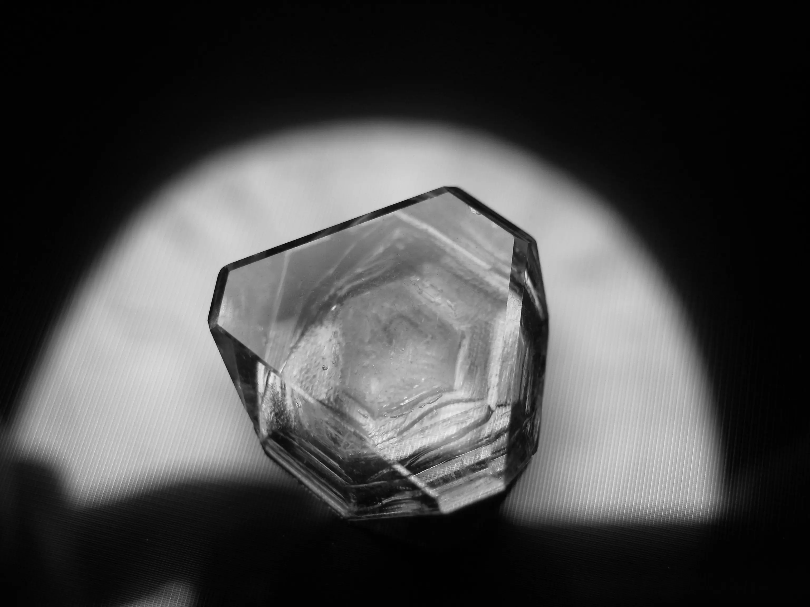
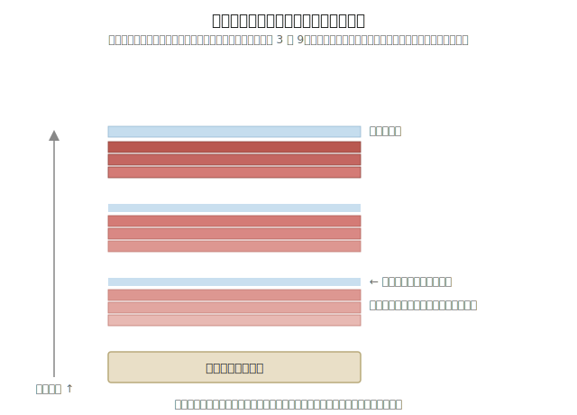
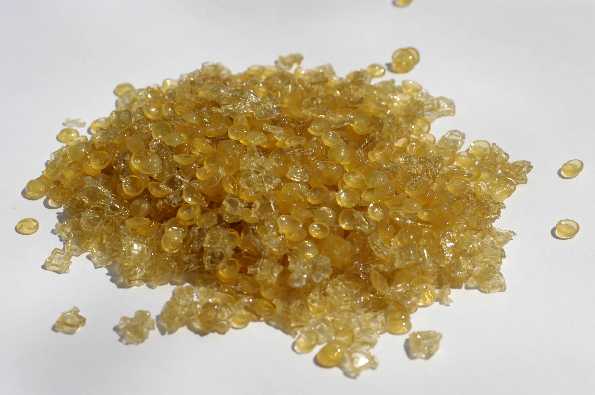
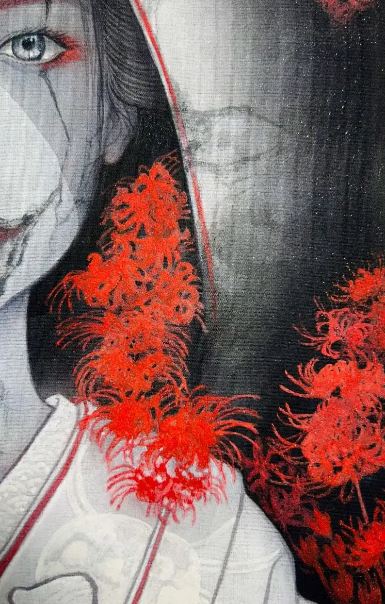

你在絹本上疊了好幾層顏料，某天發現底層開始一小片一小片剝落——問題通常不在你的筆法，而在你可能正在混用三種化學結構完全不同的膠結劑，自己卻不知道。

動物膠、植物膠、壓克力，乾燥後形成的薄膜彼此不相容，光看操作教學學不到這件事，因為前排文章清一色只講「膠礬水怎麼調」，沒人告訴你為什麼需要它、以及它本身也有代價。這篇把膠礬水放回三大膠結劑衝突的脈絡裡講，還加了一組多數教學不會給的數字：動物膠的 pH 值與機械強度數據，讓你知道自己在跟什麼樣的材料打交道。

## 膠礬水是什麼

膠礬水，就是在膠水裡加入少量明礬調成的透明混合液。膠是最原始的繪畫媒材之一，取自動物的皮、骨、筋腱；明礬則是含結晶水的硫酸鉀鋁複鹽，無色透明。兩者混合後有幾個關鍵功能：中和紙絹本身的鹼性、防止顏料滲透基底、固定顏料顆粒防止剝落，同時也有一定防蟲效果。

*明礬結晶。圖片來源：[Ude](https://commons.wikimedia.org/wiki/File:Potassium_alum_octahedral_crystal.jpg)，CC BY-SA 3.0*

<!-- 🖼️ 待補：調好的膠礬水（透明液體）實拍照，Wikimedia 上沒找到現成可用的，建議自己拍一張 -->

生紙、生絹要處理成能作畫的熟紙、熟絹，膠礬水是關鍵一步——絹本通常要上三次（正面、背面、正面），礬水才會均勻分佈。工筆重彩講究反覆分染、層層堆疊顏色，這就是古畫論裡說的「三礬九染」——但「三」跟「九」是傳統說法裡的**虛數**，代表「多次」，不是字面真的算三次跟九次；實際操作是**分染很多輪、薄薄地一層層疊色，每隔好幾輪染色才罩一次膠礬水固色**，不是每疊一層顏色就上一次膠礬水。膠礬水本身有代價（後面會講），用太密反而划不來，這也是為什麼傳統技法本來就把它設計成「間隔多輪才用一次」，不是逢層必上。

*示意圖畫 3 層膠礬水，是照傳統技法名稱畫的示意比例，不是科學實驗驗證過的「安全層數」——下一節會講到，目前查到的老化研究只測過「塗一次 vs 完全不塗」，沒有人測過疊加幾層之後才開始明顯脆化，圖上的層數請當作技法概念理解，不要當成「幾層以內安全」的數字依據。

絹本另外還有個特性會放大這個問題：絹是半透明的，正面與背面都能著色，很多技法（像是背染、裏彩色）就是利用這個半透明特性做出來的層次感。我在另一篇整理深色背景畫主體的技法時也處理過類似的絹本疊層問題（見[工筆畫深色背景畫法](/Blog/gongbi-silk-dark-background.html)），跟這篇的膠結劑衝突是兩個不同層次的坑——一個是「顏色透不透得出來」，一個是「膠會不會互相排斥剝落」，但都源自絹本疊層創作的特殊性。

## 膠結劑三體系為什麼會衝突

膠礬水解決的問題，其實是更大的材料衝突：繪畫裡常見的膠結劑分屬三個化學體系，動物膠是蛋白質、植物膠（如阿拉伯膠）是多醣類、壓克力乳液則是高分子聚合物。三者乾燥後形成的薄膜，彼此之間**無法產生化學鍵結**，只能物理性堆疊——濕度一變化，接縫處就容易分離剝落。這不是我自己的推論，[文物修復界有正式名稱](https://conservation-wiki.com/wiki/Paint_Consolidation)叫「interlayer cleavage（層間剝離）」，美國與澳洲的文物保存學會都收錄同一個定義：層與層化學、物理不相容就是主因。

具體一點說：當你在已經乾燥的植物膠層（比如水彩底色）上，塗上以動物膠調和的礦物顏料，新塗層的膠結劑沒辦法跟舊塗層產生化學鍵結，只能靠物理性的「疊上去」勉強黏住。這種疊法平常看不出問題，一旦環境濕度變化、或作品沾到水，兩層之間就會直接分離、掉粉。壓克力則是另一種麻煩：它的附著力極強、幾乎跟什麼都黏得住，但乾燥後形成的是連續性塑膠薄膜，會把礦物顏料顆粒整個包覆起來，讓顏料原本的結晶折射效果被悶住，也摸不到礦物顏料特有的粉質顆粒感——用壓克力點綴局部沒問題，但大面積取代動物膠，等於犧牲掉礦物顏料最珍貴的質感。

| 膠結劑類型 | 化學性質 | 核心特性 | 主要風險 |
|:---|:---|:---|:---|
| 動物膠（明膠、鹿膠、牛膠） | 蛋白質，水溶性 | 溫潤透明、與礦物顏料搭配極佳 | 易水解、難抓膠比 |
| 植物膠（阿拉伯膠） | 多醣類，水溶性 | 操作便利、乾燥快 | 韌性差，不宜厚塗 |
| 合成膠（壓克力乳液） | 高分子聚合物，乾後防水 | 附著力極強、穩定性高 | 包覆性太強，影響礦物顏料發色 |

*動物膠（骨膠）顆粒。圖片來源：[Simon Eugster](https://commons.wikimedia.org/wiki/File:Knochenleim_Granulat.jpg)，CC BY-SA 3.0*

多數教學文章講到這裡就停在「怎麼調膠礬水」，但真正決定你會不會踩坑的，是背後的數字。根據國立台灣美術館發行的期刊文章，動物膠依來源分成皮膠與骨膠，皮膠水溶液呈中性（pH 6.5–7.4），骨膠則略偏酸性（pH 5.8–6.3）；動物膠拉伸強度可達 444.8mpa、剪切強度常超過 20.68mpa，是相當堅韌的材料。但它是**可逆性膠**——加熱會變回液態、冷卻又固化，前提是**溫度不能超過攝氏 70 度**，一旦超過就會破壞蛋白質結構、永久喪失黏性；反覆加熱或加鹽同樣會讓它難以再固結。這跟坊間膠礬水教學裡常提到的「煮膠溫度不得超過 70 度」是同一件事，只是這裡多了一層學術數據佐證，而不只是經驗談。

顏料呈色的差異也跟膠結劑有關：用水性膠（動物膠）調和礦物顏料時，顏料顆粒之間會留有空隙，光線在顆粒表面與內部反覆反射、折射，形成礦物顏料特有的層次感，稱作「顏料層的表面發色」。換成油這類黏著劑時，色層幾乎沒有空隙，光線只會單純地二邊反射——尤其石青、石綠這類折射率較小的顏料，色澤反而會變得比較暗淡。這也是為什麼工筆重彩偏好水性膠而不是油性媒材。

顆粒粗細也會影響同一種礦物顏料的深淺：顆粒愈粗，光線通過內部的距離愈長，被吸收得愈多，顏色就愈深；顆粒愈細，光路短、反射出來的光愈多，顏色就愈淺。同一罐礦物顏料，研磨得細一點跟粗一點，畫出來的深淺可以差到讓人以為是兩種顏色——這也是為什麼礦物顏料的色階表往往比水彩、廣告顏料細很多，同一色名底下能分出七、八階深淺。

## 傳統做法：膠礬水的配製比例與步驟

膠礬水沒有一個「標準」比例，配方會隨紙絹種類、季節微調。常見的幾種配方：

| 來源 | 比例 |
|:---|:---|
| 官方研究測試配方 | 膠：明礬：水 ＝ 15：5：1000 |
| 民間常見配方（紙本） | 膠 5g：生明礬 2.5g：水 250cc |
| 民間常見配方（絹本） | 膠 20g：水 900ml＋生明礬 5g |
| 古法季節調整（依《芥子園畫譜》） | 夏六膠四礬、秋八膠二礬、冬七膠三礬 |

操作步驟大致是：膠固體先泡水一晚，隔水加熱到 70 度左右完全溶解（**不能超過**，前面已經解釋原因），關火後加入明礬慢慢攪拌，過濾雜質、裝瓶冷藏備用。上膠礬水時用專用排筆沾滿，朝同一方向刷過，避免紙絹纖維起毛球；盡量選晴天操作，濃度也寧可偏稀——濃度太高反而容易讓紙絹變質脆裂。

季節也要考慮進去：夏天濕度高、膠液容易發霉變質，配比會偏向多膠少礬；冬天乾燥則相反，礬的比例可以拉高一點幫助固著。生絹轉熟絹的三次上膠礬水（正面、背面、正面），每次之間也要讓紙絹完全乾透才能上下一次，急著疊上去反而容易讓水氣悶在中間，乾燥後出現不均勻的色塊或摺痕。

## 膠礬水的酸化風險——以及我為什麼改成整幅完成後才上一層

膠礬水不是萬靈丹，它的代價常常被前排教學文章略過不提：明礬本質是酸性物質，長期使用會讓紙絹偏酸、變硬變脆。[一份研究高耐久性膠彩畫用紙的政府研究報告](https://www.moa.gov.tw/ws.php?id=22841)做過加速老化實驗——紙張經過 10 天乾熱老化後，有刷塗膠礬水的紙張耐摺力明顯下降；改用「中鹼性上膠劑」直接處理、省去傳統膠礬水步驟的自製紙張，耐摺力反而優於進口紙 2 倍以上，部分甚至達 20 倍。

**這裡要老實講清楚這項數據的邊界**：這個實驗測的是「塗一次膠礬水」跟「完全不塗」的二元比較，**不是**疊塗好幾層之後的累積效應——目前查到的資料裡，沒有任何研究測過「疊加幾層膠礬水才會開始明顯脆化」這種劑量門檻，前面那張三礬九染示意圖畫 3 層，也只是照傳統技法的說法示意、不是安全層數的科學根據。這代表：膠礬水會讓紙絹偏酸、長期不利保存，這件事是有研究支持的；但「疊越多層風險越高」是常識上合理的推論，不是這份研究直接測出來的數字。寫作當下（截至 2026 年初）也沒查到更廣泛的後續驗證，實際操作前建議自己也做小範圍測試。

*這件作品的局部現況（拍攝於 2026 年 7 月），紅花部分就是本文討論的礦物顏料厚塗區域，目前尚未上最後一層膠礬水保護。*

原本打算在兩個膠結劑之間，局部刷一層膠礬水做界面，隔離植物膠與動物膠。但查完酸化風險的資料後，我暫且保留這個做法——雖然沒有研究證明疊層次數跟脆化程度的關係，但明礬確實會讓紙絹偏酸。**目前階段性的做法是整幅畫完才上一層膠礬水**當最後保護層。但這還不是定案，我的上色工作流還在邊做邊調整中。基於「膠礬水有酸化代價」這個確定事實的謹慎選擇，不是精算過的最佳解——如果你的疊層更複雜、體系衝突更明顯，中途隔離可能還是必要的。

## 常見誤區

- **煮膠溫度超過 70 度**：蛋白質結構被破壞，膠液直接喪失黏性，之後怎麼調都救不回來
- **膠礬水濃度過高**：紙絹容易變質脆裂，寧可偏稀、分次補刷
- **把膠礬水當萬用固色劑，越多越保險**：明礬本身有酸化代價，不是塗越多越安全，前一節的酸化風險就是這個誤區的反例
- **調好的膠礬水放太久才用**：[有經驗的創作者提醒](https://taiwritings.blogspot.com/2020/05/blog-post_1.html?m=0)，膠遇水就開始計算腐壞時間，就像生食一樣，最好放冰箱冷藏、盡快用完

YouTube 上也有創作者直接示範「如何製作會滲漏的膠礬水」這類反面教材（阿芷塗白紙頻道），說明這些誤區在實際操作中確實常見，不是紙上談兵。

## 30 秒看懂：常見問題

**膠彩畫跟水墨畫差在哪裡？**
膠彩畫以礦物顏料加動物膠為主要媒材，色彩厚重穩定、可堆疊出立體層次；水墨畫則以墨與水為核心，講究筆墨韻味與留白，兩者媒材脈絡和美學追求完全不同，不是同一種畫種的兩種畫法。

**膠礬水一定要上嗎？**
傳統絹紙處理流程裡是必要步驟，但現代也有中鹼性上膠劑之類的替代方案可以跳過膠礬水這一關。要不要用，取決於你願意承擔多少酸化風險、以及作品對長期保存性的要求。

**調好的膠礬水能放多久？**
不建議久放。膠遇水即開始劣化，冰箱冷藏可以延緩，但還是建議盡快用完，別當成常備庫存。

**礦物顏料為什麼比較貴、比較難買？**
[根據台灣膠彩畫材料史的整理](https://twfineartsarchive.ntmofa.gov.tw/QuarterlyFile/P0850300.pdf)，台灣本身不生產礦物顏料，長期需從日本、大陸進口，早期一度因為兩地關係變化而斷貨，材料取得困難是台灣膠彩畫發展史上長年的痛點——過去甚至有老師自費買顏料供學生使用，只為了讓創作能持續下去。這也是為什麼很多創作者對膠結劑的選擇特別謹慎：顏料得來不易，自然不希望因為體系衝突白白剝落浪費。

## 寫在最後

膠礬水這個題目，中文圈幾乎都是「怎麼調」的操作教學，很少有人把它放回三大膠結劑衝突的脈絡裡講，更少人會去查動物膠的 pH 值和機械強度數據。查完這輪資料後我自己最大的體會是：膠礬水從來不是「保護就對了」的萬用解，它是一個有代價的化學選擇——你多上一層，就多一次酸化曝露，少上一層，就少一分界面保護，中間沒有零風險的選項，只有你願意承擔哪一種風險。

如果你也在絹本或紙本上疊過不同膠結劑、踩過類似的剝落坑，留言告訴我你遇到的狀況——之後會再寫一篇專門拆解「顏料剝落原因」的深度篇，把這次沒展開的案例整理進去。

## 參考來源

- 高永隆，〈解構台灣膠彩畫──透視礦物顏料、動物膠的美麗與虛幻〉，[國立台灣美術館](https://twfineartsarchive.ntmofa.gov.tw/QuarterlyFile/P0850300.pdf)
- [高耐久性膠彩畫專用紙之研製](https://www.moa.gov.tw/ws.php?id=22841) — 農業部全球資訊網
- [煮膠礬、上裱、上礬 事前研究](https://taiwritings.blogspot.com/2020/05/blog-post_1.html?m=0)
- [膠礬水 製作步驟](https://csangou.pixnet.net/blog/posts/10352324816)
